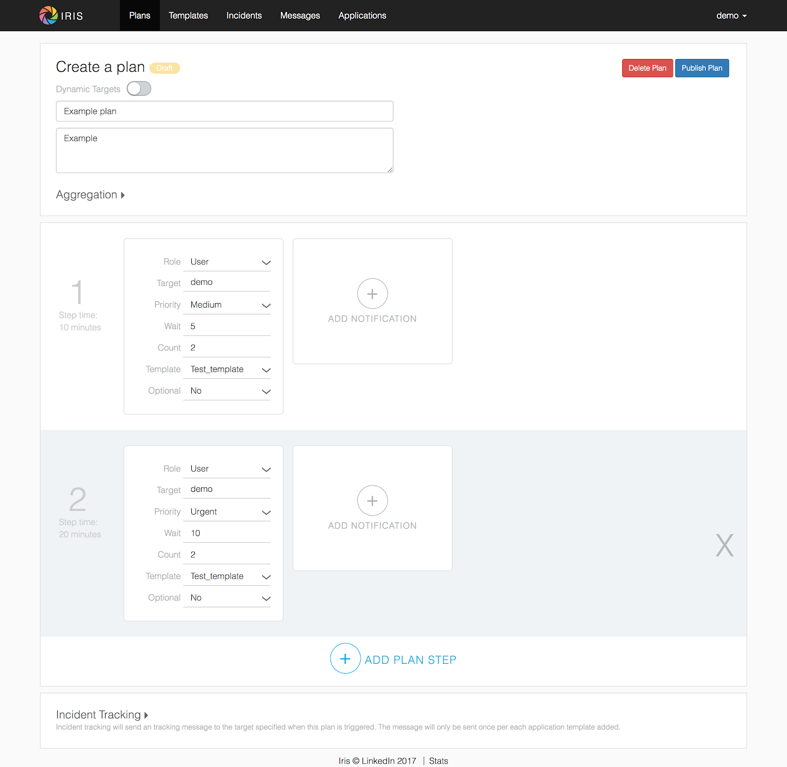
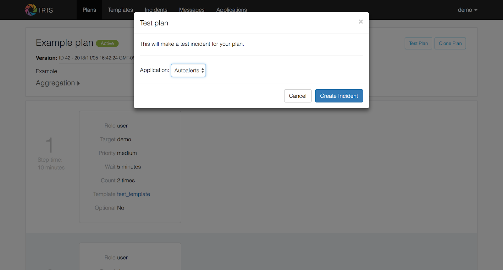
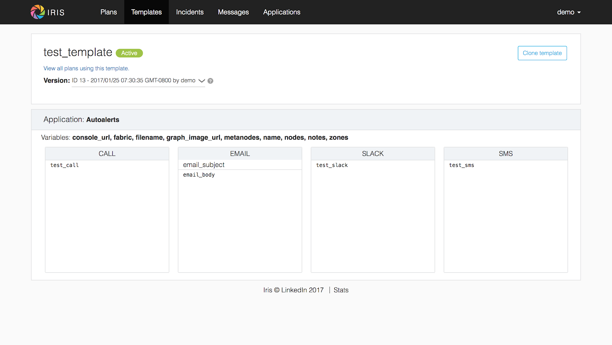
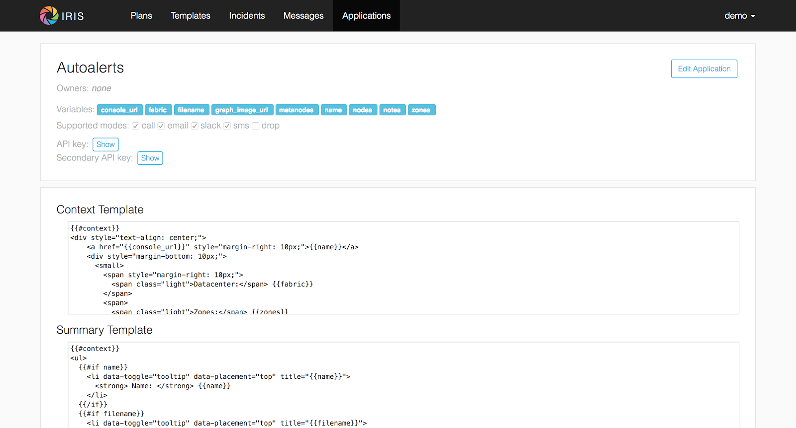
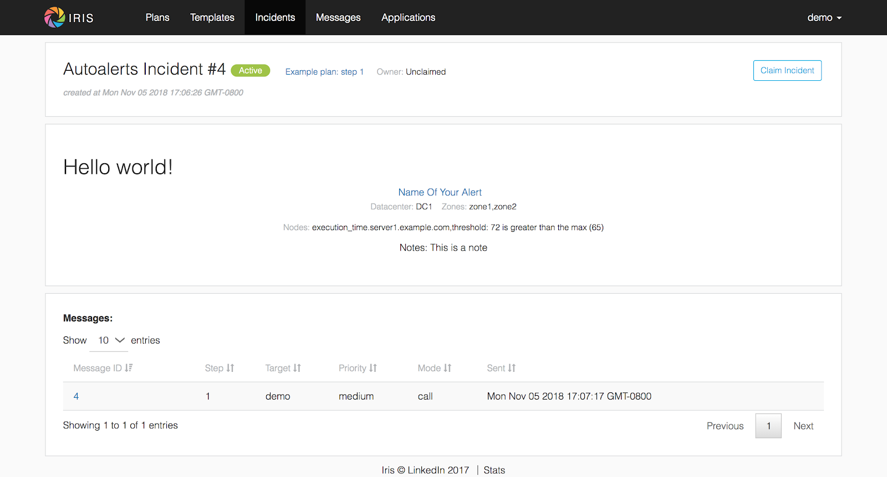
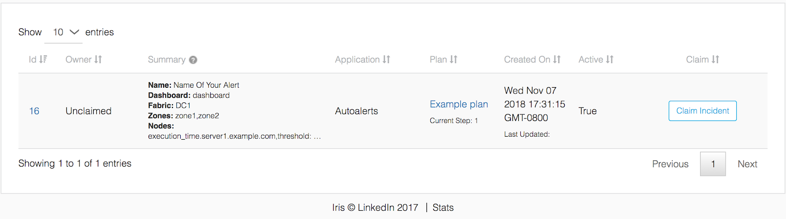

Quickstart
==========

Pre-requisites
--------------

Before starting this guide, ensure the following are
installed/configured properly:

 - Git
 - MySQL 5.7
 - Python 2.7

Setting things up
-----------------

First thing's first: clone the Iris repo:

.. code:: sh

    git clone https://github.com/linkedin/iris.git

Let's take a quick look through the source code.
 - ``ops`` - examples of deployment options with Docker, Kubernetes, etc
 - ``db`` - schema and dummy data for testing
 - ``test`` - end-to-end tests and unit tests
 - ``src/iris`` - the main source code directory
     - ``bin`` - various daemons. The biggest one to note here is ``sender.py``, which handles Iris's message sending
     - ``api.py`` - Main REST API code
     - ``ui`` - Frontend JS, CSS, and static assets. Also contains authentication modules for the FE, and bundling setup.
     - ``vendors`` - Pluggable modules handling message sending for various contact modes. Leveraged by the Iris sender.

Set up a virtual env, install dependencies, and set up development
environment.

.. code:: sh

    virtualenv venv
    source venv/bin/activate
    sudo apt-get install libssl-dev libxml2-dev libxslt1-dev libsasl2-dev python-dev libldap2-dev
    pip install -e '.[dev,kazoo]'

Configuring the database
------------------------

Out of the box, Iris expects the database to be set up with username
``root`` and no password. This isn't very secure, so let's create an
``iris`` user. Log in as root, and add the new user. We'll also need to
turn off the ``ONLY_FULL_GROUP_BY`` MySQL mode.

.. code:: sql

    CREATE USER 'iris'@'localhost' IDENTIFIED BY 'iris';
    CREATE DATABASE iris;
    GRANT ALL ON iris.* TO iris@localhost;
    SET GLOBAL sql_mode=(SELECT REPLACE(@@sql_mode,'ONLY_FULL_GROUP_BY',''));

Now let’s load the schema and some dummy data. Navigate to project root,
then run:

.. code:: sh

    mysql -u iris -p < ./db/schema_0.sql
    mysql -u iris -p -o iris < ./db/dummy_data.sql

dummy\_data.sql contains the following entities: - user demo with
password demo - team demo\_team - application Autoalerts with key:
a7a9d7657ac8837cd7dfed0b93f4b8b864007724d7fa21422c24f4ff0adb2e49

Confirm that this is successful:

::

    SHOW TABLES;
    +-----------------------------+
    | Tables_in_iris              |
    +-----------------------------+
    | application                 |
    | application_mode            |
    | application_owner           |
    | application_quota           |
    | application_stats           |
    | default_application_mode    |
    | device                      |
    | dynamic_plan_map            |
    | generic_message_sent_status |
    | global_stats                |
    | incident                    |
    | incident_emails             |
    | mailing_list                |
    | mailing_list_membership     |
    | message                     |
    | message_changelog           |
    | mode                        |
    | plan                        |
    | plan_active                 |
    | plan_notification           |
    | priority                    |
    | response                    |
    | target                      |
    | target_application_mode     |
    | target_contact              |
    | target_mode                 |
    | target_reprioritization     |
    | target_role                 |
    | target_type                 |
    | team                        |
    | template                    |
    | template_active             |
    | template_content            |
    | template_variable           |
    | twilio_delivery_status      |
    | twilio_retry                |
    | user                        |
    | user_setting                |
    | user_team                   |
    +-----------------------------+
    39 rows in set (0.00 sec)

    mysql> SELECT * FROM target;
    +----+-----------+---------+--------+
    | id | name      | type_id | active |
    +----+-----------+---------+--------+
    |  1 | demo      |       1 |      1 |
    |  2 | abc       |       1 |      1 |
    |  3 | foo       |       1 |      1 |
    |  4 | demo_team |       2 |      1 |
    |  5 | foo_team  |       2 |      1 |
    |  6 | abc       |       3 |      1 |
    |  7 | demo      |       3 |      1 |
    +----+-----------+---------+--------+
    7 rows in set (0.00 sec)

We have an Iris database now! Update the configs so Iris can read the
DB. These live in ``configs/config.dev.yaml``. Change this

::

   db: &db
     conn:
       kwargs:
         scheme: mysql+pymysql
         user: root
         password: ""
         host: 127.0.0.1
         database: iris
         charset: utf8
       str: "%(scheme)s://%(user)s:%(password)s@%(host)s/%(database)s?charset=%(charset)s"
   </pre>

To this, updating user/password accordingly:

::

   db: &db
     conn:
       kwargs:
         scheme: mysql+pymysql
         user: iris
         password: iris
         host: 127.0.0.1
         database: iris
         charset: utf8
       str: "%(scheme)s://%(user)s:%(password)s@%(host)s/%(database)s?charset=%(charset)s"

Almost ready! Use ``make`` in project root directory to run Iris API,
then verify with curl:

.. code:: sh

    $ curl localhost:16649/v0/targets
    ["abc","demo","demo_team","foo","foo_team"]

Creating an escalation plan
---------------------------

Navigate to the "Plans" page using the top bar. Click “Create New Plan”
on the top right to make a new escalation plan. |create-plan|

Let's focus on the main content here. There’s additional settings for
Aggregation, Incident tracking etc, but we can take a look at those
later. Our plan has a name, description, and list of steps. Each step
has a number of notifications. Iris will send messages according to this
escalation plan until someone acknowledges (claims) the incident. After
claiming, escalation will stop, and no more messages will be sent.

Defining terms:
---------------

“Role” and “Target” determine the recipient of the message. Here, our
role is “User”, and our target is “Demo”, meaning that we’re sending a
message to the demo user. Other roles allow for dynamic definitions in
escalation plans; for example, the “Oncall-Primary” role allows Iris to
look up the on-call engineer for a target team when escalating. For now,
we’ll just focus on user, which is the simplest role.

“Priority” determines the importance of the message. Users can map
different priorities to different contact modes. For example, user A
might decide to map “medium” messages to SMS, while user B might map
medium to emails instead. By default, this mapping is: Low: email
Medium: email High: sms Urgent: call

“Wait” determines how many minutes to wait after sending a message
before proceeding to the next one. “Count” determines how many times the
message will be repeated before moving on.

“Template” defines the template used to generate message content. Iris
allows you to customize message content using this template definition.
To generate the message, Iris will render the template with the incident
context and pass along the resulting content.

Finally, “Optional” allows messages to fail without raising an alert.
Otherwise, if Optional is false, a message that cannot be delivered will
result in an alerting message sent to the plan creator. Setting this to
true can be useful for (role, target) combinations that may not always
be present (e.g. oncall-secondary).

Back to the plan
----------------

In step 1, we send a medium priority message to the demo user two times,
waiting five minutes after sending each message before sending the next.
After that, we send two urgent messages, waiting 10 minutes between.
Let’s publish the plan with the button on the top right. Back in the
Iris UI, give your new plan a test by clicking the button on the top
right. Use the Autoalerts application. |test-incident|

We’ve made an incident! But, if we navigate to the “Incidents” page,
we’ll see that there’s no currently active incidents. This is because
our incident hasn’t yet sent a message. For messages to be sent, we’ll
need to get the Iris sender daemon running.

Iris sender
-----------

In the root directory of the project, activate the virtualenv and run
``make sender`` (Keep Iris API running as well). Iris sender is
responsible for message sending. It runs on a 60 second loop, checking
the DB for new incidents and creating messages for those incidents if
necessary. A lot of Iris’s complexity lives here, so we’ll be coming
back to the sender shortly. For now, let’s set it running and test out
our new escalation plan. The logs should have a snippet similar to
below:

::

    2018-11-06 01:07:17,963 INFO root [*] 1 new incidents
    2018-11-06 01:07:17,975 INFO root [*] 1 new messages
    2018-11-06 01:07:17,975 INFO root [*] escalate task finished
    2018-11-06 01:07:17,975 INFO root [-] start deactivate task...
    2018-11-06 01:07:17,979 INFO root [*] deactivate task finished
    2018-11-06 01:07:17,979 INFO root [-] start send task...
    2018-11-06 01:07:17,981 INFO root 1 new messages waiting in database - queued: 0
    2018-11-06 01:07:17,981 INFO root [*] send task finished
    2018-11-06 01:07:17,982 INFO root [-] start aggregate task - queued: 0
    2018-11-06 01:07:17,985 INFO root Sending message (ID 4) locally
    2018-11-06 01:07:17,986 INFO iris.vendors.iris_dummy SEND: call Autoalerts +1 223-456-7890

Here, we see that Iris sender has sent a dummy call to +1 233-456-7890
(the phone number configured for the demo user). Now, if we navigate to
the incidents list, we’ll see that our incident has shown up. We can now
claim the incident from the UI to stop further escalation.

Sending a real message If we want to send a real message, we’ll first
need to configure Iris sender to use a different message vendor.
Currently, the config is set up to use the iris\_dummy vendor, which
logs messages without actually sending anything. Instead of that, let’s
set up something using Twilio, which provides call and SMS services. You
can set up a free Twilio account pretty easily at `this
link <https://www.twilio.com>`__. After that, set up a new project with
programmable SMS and voice. We’ll need a few things from Twilio to get
started: a Twilio phone number, an Account SID, and an Auth token. In
addition, we’ll need to set up a TwiML Bin to generate the content of
our messages without needing to spin up a new webserver. Some docs for
that can be found
`here <https://www.twilio.com/blog/2016/05/introducing-native-twiml-bins-powered-by-the-twilio-cloud.html>`__.
We’ll want the content of our bin to be:

.. code:: html

    <?xml version="1.0" encoding="UTF-8"?>
    <Response>
      <Say language="en-US" voice="alice">
        {{content}}
      </Say>
    </Response>

Head back to ``configs/config.dev.yaml``. On line 139, we see a skeleton
configuration for the Twilio message vendor:

::

    #- type: iris_twilio
    #  name: twilio_1
    #  account_sid: ''
    #  auth_token: ''
    #  twilio_number: ''
    #  relay_base_url: ''

Change this to match below, filling in the account\_sid, auth\_token,
and twilio\_number fields appropriately. We’ll also need to fill in the
relay\_base\_url with the url of our TwiML bin, and configure the
say/gather endpoints to the empty string. This way, Twilio will hit the
TwiML bin URL without any trailing endpoint, which is needed for this to
work properly. When you’re done, the config should look like this:

.. raw:: html

   - type: iris_twilio
     name: twilio_1
     account_sid: ‘AC123…’
     auth_token: ‘abc…’
     twilio_number: ‘+11234567890’
     relay_base_url: 'https://handler.twilio.com/abc'
     say_endpoint: ‘’
     gather_endpoint: ‘'
   </pre>

We’ll need to remove the “[]” from the ``vendors: []`` line on 118, and
set ``debug: False`` in the sender settings on line 59. Re-run make/make
sender to pick up the new configurations. Finally, change the contact
info for the demo user to match the number you verified with Twilio:

.. code:: sql

    UPDATE target_contact
    SET destination = '+1 123-456-7890'
    WHERE target_id = (SELECT id FROM target WHERE name = 'demo' AND type_id = 1)
    AND mode_id IN (SELECT id FROM mode WHERE name='sms' OR name='call');

Now, we can use the iris\_twilio vendor for sending messages. Let’s
trigger another incident, using the “Test Plan” button for “Example
plan” in the same way we did before. Make sure Iris sender is running,
and wait for Iris to call. After a minute or so, you should receive a
phone call from your Twilio number saying “test\_call”. ## Customizing
call content Now that we’ve set up phone calls via Twilio, let’s
customize the message content to say something a little more useful than
“test\_call”. To do that, we’ll need to modify the template that our
escalation plan is using. If we examine the notifications in “Example
plan”, we see that hey all use the “test\_template” message template.
Let’s make some changes to that. Navigate to the Templates page, and
click on test\_template in the list on that page. |template| Here, we
see that test\_template defines message content for a number of
different contact modes. For now, let’s focus on call. Note that this
template defines content for a specific application, Autoalerts.
Autoalerts defines a number of variables, which are shown on the page as
well. Our template can inject the value of any of these variables into
the message content using Jinja template syntax. As an example of this,
let’s change the content of the call message to:

::

    Hello world! {{ notes }}

Clone the template, make the change, then publish the new template. This
will deactivate the previous version of the template. The “Example plan”
escalation plan will use the new version of “test\_template” when it
creates a message from now on, ignoring the previous version. Let’s
check it out by testing “Example plan” again. We should get a call now
saying “Hello world! This is a note.”

A deeper look at applications
-----------------------------

In the previous section, we discussed that test\_template defined
message content on a per-application basis. Let’s dive a little deeper
into the concept of an Iris application. Each Iris app represents an
integration with Iris. To explain this a more clearly, let’s look at
Autoalerts as an example.

Head to the “Applications” page, and click on Autoalerts in the list
that shows up. We should get something that looks like this:
|application|

At the top, we see that the application defines a number of variables.
When this application creates an Iris incident, it provides a context
JSON object that defines these variables. As we saw earlier, this
incident context is rendered via the escalation plan’s template to
create the message content. When we trigger an incident with the “Test
Plan” button, we use the sample context defined on this page as the
incident’s context. For example, in the previous section, we sent a
phone call using the ``{{notes}}`` variable, which is defined as “This
is a note” in the Autoalerts sample context.

Applications also define a context template, which defines the content
of the Incident details page in the Iris UI. We can edit this template
here and see the result when we navigate back to the incident detail
page. For example, try adding a “<h2> Hello World! </h2>” below the
“{{#context}}” line. When we take a look at any of our previous
incidents, we get: |hello-context|

Finally, the summary template defines the content on the incident list
page. Since each incident has a different context, it’s up to the
application to define how an incident should be summarized in the
incident list. The resulting content of the Autoalerts summary template
is shown below. |summary-list|

Triggering incidents programmatically
-------------------------------------

Iris applications provide an API key that can be used to trigger
incidents programmatically via the Iris REST API. Let’s take a look at
how this works by writing a quick script to trigger incidents. Using the
`Iris python client <https://pypi.org/project/irisclient/>`__, this is
pretty easy:

.. code:: python

    import irisclient

    iris = irisclient.IrisClient('Autoalerts', 'a7a9d7657ac8837cd7dfed0b93f4b8b864007724d7fa21422c24f4ff0adb2e49', 'https://localhost:16649')
    iris.incident('Example plan', {'notes': 'This is a programmatic incident!'})

Remember to make sure the sender is running, and wait for the new phone
call. This one should now say “This is a programmatic incident”. If we
define our message templates properly, our outbound messages can now
include useful information about each incident.

Adding real users
-----------------

Previously, we routed all of the messages going to the demo user to our
own phone numbers through a big SQL query run on the database. This is
obviously non-ideal. There are a number of different ways that we can
more easily import or create users. The easiest way to do this involves
another open-source project:
`iris-admin <https://github.com/jrgp/iris-admin>`__.

.. code:: sh

    git clone https://github.com/jrgp/iris-admin.git
    virtualenv env
    . env/bin/activate
    python setup.py develop
    . env/bin/activate

Then, modify the DB config in configs/config.dev.yaml to use the iris
user/password we created earlier. We can then access the Iris admin UI
from ``http://localhost:16651``. This gives us a nifty UI that we can
use to add, create, delete, and modify users.

Adding authentication
---------------------

At LinkedIn, we use LDAP for authentication. We’ve provided an
authentication module that leverages this, with example configuration
values in configs/config.dev.yaml. In addition, in src/iris/ui/auth, we
define several sample Authenticator classes, which define a constructor
and the ``authenticate(user, password)`` method. Using this interface,
custom authentication can be implemented with a variety of different
providers.

Wrapping up
-----------

After all these steps, we've now got a setup of Iris that is
development-ready. The examples in the ``ops`` directory should be a
good starting point for building more production-ready setups, using
nginx and uwsgi rather than gunicorn for better performance and allowing
for easier deployment. More questions? Reach out to
iris-oncall@linkedin.com or open an issue on Github.

